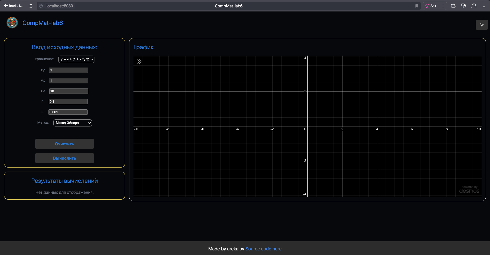
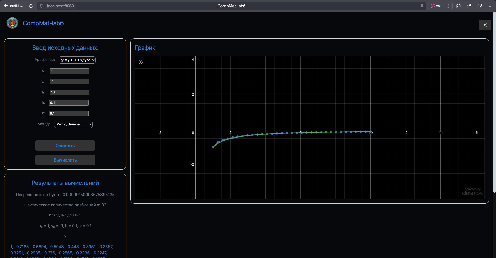
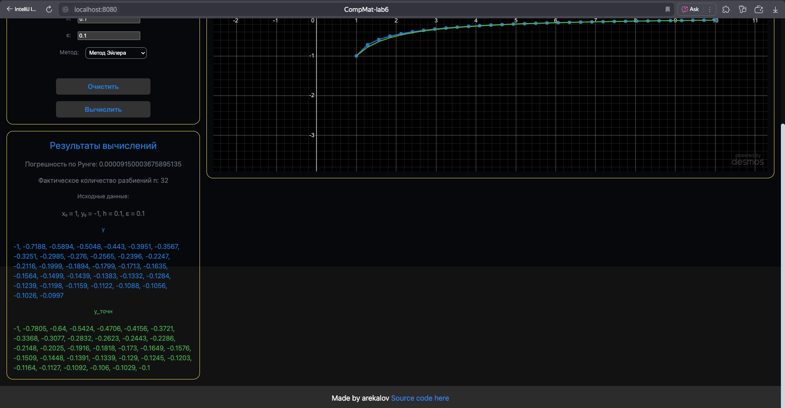

# Лабораторная работа по ВычМату №6

### Численное решение обыкновенных дифференциальных уравнений, Вариант 12

## Цель работы

Решить задачу Коши для обыкновенных дифференциальных уравнений численными методами

## Программная реализация задачи

1. Реализовать программу для решения задачи Коши для обыкновенных дифференциальных уравнений;
2. В программе численные методы решения обыкновенных
   дифференциальных уравнений (ОДУ) должен быть реализован в
   виде отдельного класса /метода/функции;
3. Пользователь выбирает ОДУ вида y'=f(x,y)
   (не менее трех уравнений), из тех, которые предлагает программа;
4. Предусмотреть ввод исходных данных с клавиатуры: начальные
   условия y0=y(x0), интервал дифференцирования [x0,xn], шаг h,
   точность eps;
5. Для исследования использовать одношаговые методы и
   многошаговые методы: метод Эйлера, метод Рунге-Кутта 4го порядка, метод Милна;
6. Составить таблицу приближенных значений интеграла
   дифференциального уравнения, удовлетворяющего начальным
   условиям, для всех методов, реализуемых в программе;
7. Для оценки точности одношаговых методов использовать правило
   Рунге;
8. Для оценки точности многошаговых методов использовать точное
   решение задачи: eps=max_(0<=i<=n)|y_iточн-y_i|
9. Построить графики точного решения и полученного приближенного
   решения (разными цветами);
10. Программа должна быть протестирована при различных наборах
    данных, в том числе и некорректных.
11. Проанализировать результаты работы программы.

## Для запуска проекта

1. ```bash
    $ cd site
    $ kobweb run
    ``` 
2. Открыть [http://localhost:8080](http://localhost:8080)
3. Для выхода нажать `Q`

## Демо




